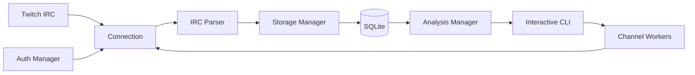
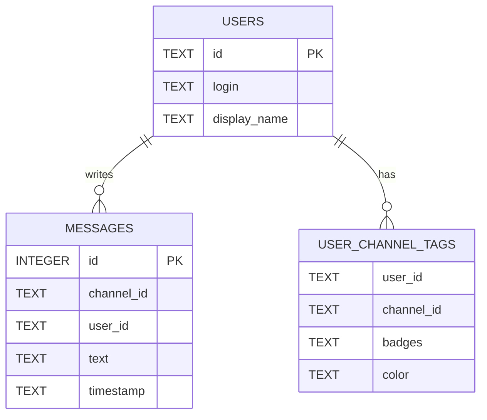

# sarcm-Twitch

<p align="center">
  <strong>A C++23 terminal tool for capturing Twitch chat, storing it locally, and exploring channel activity with lightweight analytics.</strong>
</p>

<p align="center">
  
  
  
  
  
</p>

## Overview

**sarcm-Twitch** is a console application for collecting live Twitch chat data and analyzing it locally.

The application connects directly to Twitch IRC, parses tagged `PRIVMSG` events, stores users and messages in SQLite, and exposes an interactive command-line interface for managing multiple active channel collectors and querying the accumulated chat history.

The project focuses on systems-oriented C++: asynchronous network I/O, OAuth token handling, IRC parsing, multithreaded workers, persistent storage, SQL aggregation, terminal visualization, and C++23 named modules are all implemented as separate components.

## Features

- Capture live Twitch chat through Twitch IRC
- Track multiple channels in parallel
- One background worker thread per active channel
- Twitch OAuth authorization with a local callback server
- Parse Twitch IRC tags and message metadata
- Store chat history in a local SQLite database
- Keep channel-specific user badges and Twitch colors
- Query the most active chatters in a channel
- Build an hourly message-activity histogram for a selected date
- Render usernames using their Twitch colors in ANSI-compatible terminals
- Manage collectors from a single interactive CLI
- Short aliases for frequently used commands

## Data pipeline



A channel collector establishes a TCP connection to `irc.chat.twitch.tv`, authenticates with an OAuth token, joins the requested channel, and requests Twitch IRC tags, commands, and membership capabilities.

Incoming IRC lines are processed asynchronously. `PING` messages are answered with `PONG`, while chat `PRIVMSG` events are parsed and persisted.

## Concurrent channel tracking

Each active channel is represented by a `ChatWorker`:

```text
CliManager
├── ChatWorker(channel A) ── std::thread ── Connection
├── ChatWorker(channel B) ── std::thread ── Connection
└── ChatWorker(channel C) ── std::thread ── Connection
```

The CLI keeps workers in a channel-indexed map, which allows collectors to be started, stopped, and inspected independently.

Starting the same channel twice is rejected by the CLI.

## Twitch IRC parsing

The parser extracts data from Twitch IRC messages and maps the tagged protocol representation into a structured message object.

Captured fields include:

| Field | Source |
|---|---|
| User ID | `user-id` tag |
| Login | IRC prefix |
| Display name | `display-name` tag |
| Channel | IRC target |
| Timestamp | `tmi-sent-ts` tag |
| Badges | `badges` tag |
| User color | `color` tag |
| Message text | `PRIVMSG` payload |

Moderator, VIP, and subscriber badges are recognized by the formatting layer. Twitch hex colors are converted to 24-bit ANSI escape sequences for terminal output.

## Local storage

Chat data is stored in `data/sarcm.db`.

The storage layer uses SQLite with WAL journaling and `synchronous=NORMAL`.

The current schema contains three tables:



Users are upserted as messages arrive. Channel-specific badges and colors are stored separately, while every captured chat message is appended to the message history.

All analytics operate on the local database. No external analytics backend is required.

## Analytics

### Top chatters

The `top-chatters` command counts stored messages by user, orders users by message count, and returns the most active chatters for a channel.

```text
> top-chatters some_channel 5

UserOne   1842
UserTwo   1371
UserThree  946
UserFour   731
UserFive   608
```

Usernames are displayed using their stored Twitch colors when the terminal supports 24-bit ANSI colors.

### Hourly activity

The `hourly-active` command groups messages by hour for a selected calendar date.

```text
> hourly-active some_channel 2025-09-27

18.00 | ████████ 124
19.00 | █████████████████ 263
20.00 | █████████████████████████████ 451
21.00 | ██████████████████████ 337
22.00 | ███████████ 171
```

The longest bar is scaled to the current terminal width. Other bars are normalized relative to the busiest hour.

## Commands

| Command | Alias | Description |
|---|---|---|
| `start <username> <channel>` | `add` | Start capturing a channel |
| `stop <channel>` | `rm` | Stop one active channel collector |
| `stop-all` | `rma` | Stop all active collectors |
| `status` | `s` | Show active channels |
| `top-chatters <channel> [limit]` | `tc` | Show the most active chatters |
| `hourly-active <channel> <YYYY-MM-DD>` | `ha` | Show hourly message activity |
| `!<command>` | — | Execute a local shell command |
| `q` | — | Exit the application |

The default `top-chatters` limit is `10`.

## Usage

Start the application from the repository root:

```bash
./build/sarcm
```

Start capturing chat:

```text
> start my_twitch_login some_channel
  started tracking channel: some_channel
```

Track another channel without stopping the first collector:

```text
> add my_twitch_login another_channel
  started tracking channel: another_channel
```

Inspect active collectors:

```text
> status
  active channels:
  - some_channel
  - another_channel
```

Run analytics on already stored messages:

```text
> tc some_channel 10
> ha some_channel 2025-09-27
```

Stop one collector or all collectors:

```text
> stop some_channel
> stop-all
```

## Authorization

The authentication component requests the Twitch `chat:read` scope.

When authorization is required, the application starts a local HTTP callback listener on port `8080` and prints an authorization URL. Open the URL in a browser and complete the Twitch authorization flow.

The callback URI used by the current configuration is:

```text
http://localhost:8080/callback
```

The received access token is cached locally in:

```text
token.txt
```

> `token.txt` contains an OAuth access token. Treat it as a secret and do not commit it to the repository.

The Twitch client configuration is currently defined in `app/core/auth/auth.cppm`.

## Build

### Requirements

The current build configuration is Linux-oriented and expects:

- CMake `4.0+`
- Ninja
- Clang with C++23 and C++ module support
- libc++
- standalone Asio headers
- SQLite3 development files

The CMake configuration explicitly uses C++23 modules and Clang/libc++-specific compiler options.

### Configure and build

Clone the repository:

```bash
git clone https://github.com/flicherr/sarcm-twitch.git
cd sarcm-twitch
```

Create the runtime data directory:

```bash
mkdir -p data
```

Configure the project with Clang and Ninja:

```bash
cmake -S . -B build \
  -G Ninja \
  -DCMAKE_CXX_COMPILER=clang++
```

Build:

```bash
cmake --build build --parallel
```

Run from the repository root:

```bash
./build/sarcm
```

Running from the repository root is important because the current application uses relative paths for `data/sarcm.db` and `token.txt`.

## Architecture

The codebase is organized around C++23 named modules:

| Module | Responsibility |
|---|---|
| `tcli` | Interactive command parsing and channel worker management |
| `auth` | OAuth URL generation, callback server, and token cache |
| `connection` | Twitch IRC connection and asynchronous message reading |
| `parser` | Twitch IRC tag and `PRIVMSG` parsing |
| `storage:entities` | Storage-layer data structures |
| `storage` | SQLite schema, inserts, upserts, and analytics queries |
| `analysis` | Analytics API used by the CLI |

```text
app/
├── cli/
│   └── cli.cppm
├── core/
│   ├── analysis/
│   │   └── analysis.cppm
│   ├── auth/
│   │   └── auth.cppm
│   ├── connection/
│   │   └── connection.cppm
│   ├── parser/
│   │   └── parser.cppm
│   ├── storage/
│   │   ├── entities/
│   │   │   └── entities.cppm
│   │   └── storage.cppm
│   ├── exporter/
│   └── replay/
└── main.cpp
```

The `exporter` and `replay` directories are reserved in the current source tree but are not part of the active build yet.

## Current scope

The current implementation is focused on **live chat capture and local activity analytics**.

Implemented analytics currently include:

- top chatters by stored message count
- hourly message activity for a channel and date

Chat replay, data export, and word/phrase frequency analysis are not part of the active implementation in the current source tree.